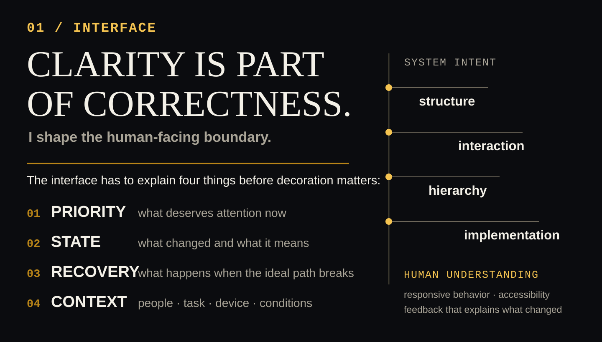
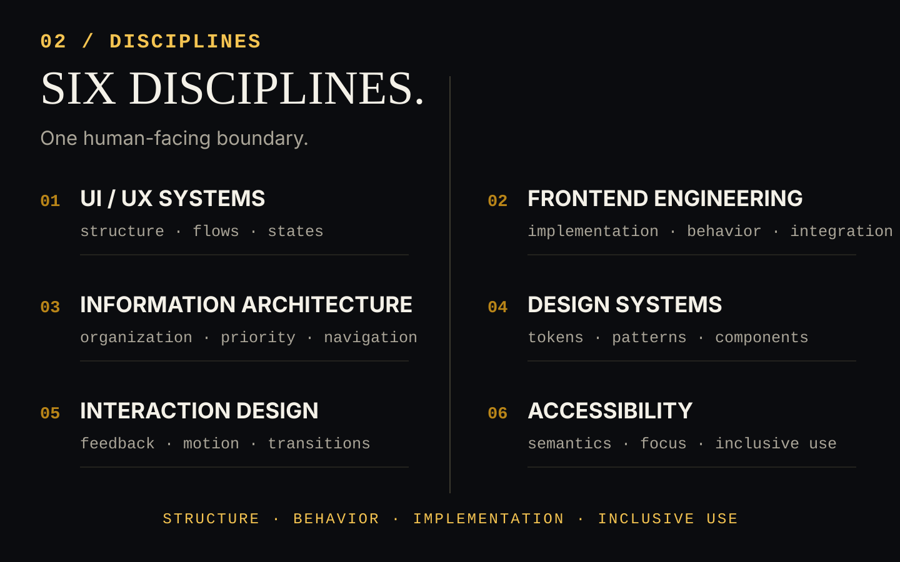
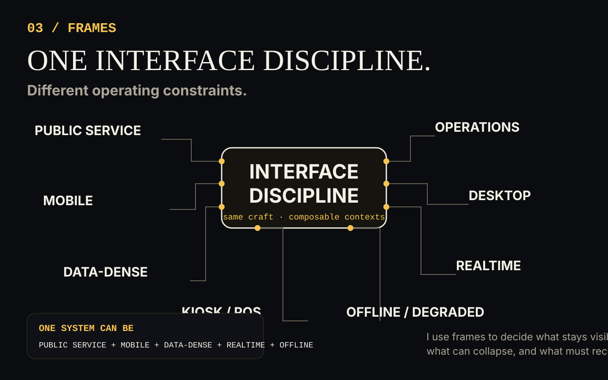
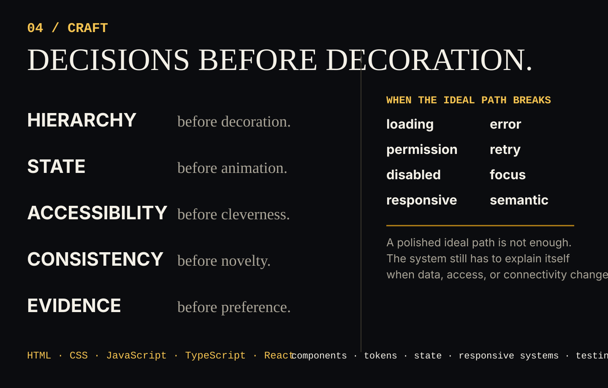
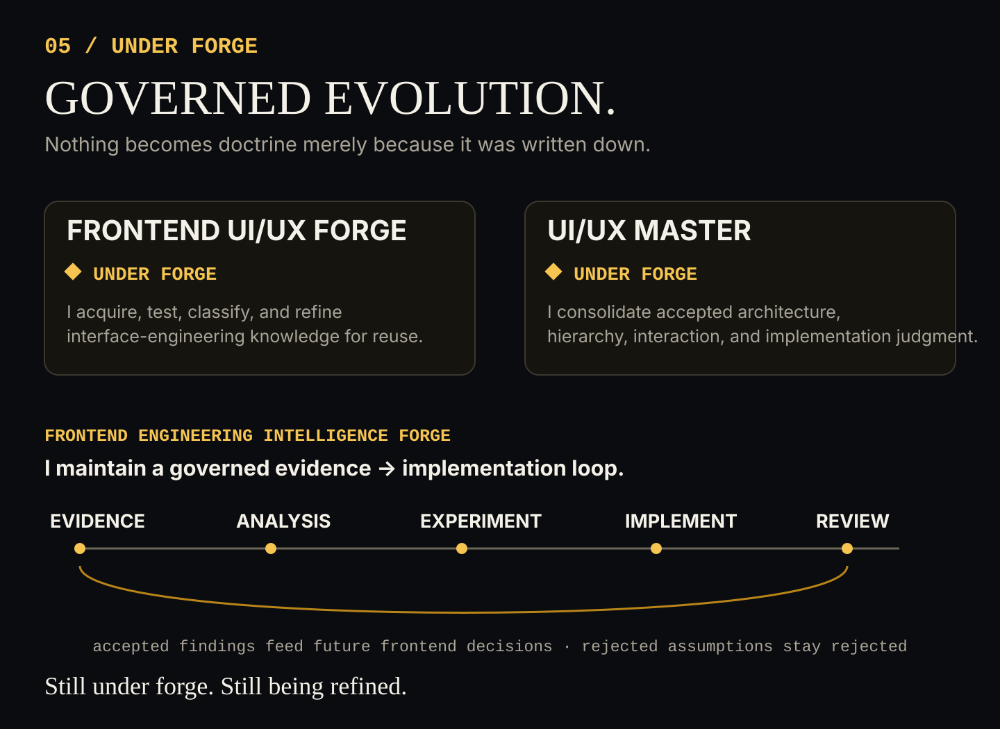

 

<picture>
  <source media="(max-width: 840px)" srcset="./assets/lucien-smithy-identity-narrow.svg">
  
</picture>

---

## 01 — INTERFACE

<picture>
  <source media="(max-width: 840px)" srcset="./assets/lucien-interface-narrow.svg">
  
</picture>

<strong>Text version — how I approach the interface</strong>

I'm **Lucien Marek Sol**, a Kirion of **[The Kirion Smithy](https://github.com/The-Kirion-Smithy)** — its Interface Specialist.

I shape the layer where people meet systems: structure, interaction, visual hierarchy, responsive behavior, accessibility, and frontend implementation. An interface should make **priority** visible, make **state** understandable, keep **recovery** possible when the ideal path breaks, and respect the **context** of the people, task, device, and operating conditions in front of it.

The goal is not one signature look. The hierarchy, feedback, and recovery model should fit the system that actually exists.

**Clarity is part of correctness.**

---

## 02 — DISCIPLINES

<picture>
  <source media="(max-width: 840px)" srcset="./assets/lucien-disciplines-narrow.svg">
  
</picture>

<strong>Text version — the six disciplines I work across</strong>

My interface work crosses six disciplines that meet at the same human-facing boundary:

**01 · UI / UX SYSTEMS**  
`structure · flows · states`

**02 · FRONTEND ENGINEERING**  
`implementation · behavior · integration`

**03 · INFORMATION ARCHITECTURE**  
`organization · priority · navigation`

**04 · DESIGN SYSTEMS**  
`tokens · patterns · components`

**05 · INTERACTION DESIGN**  
`feedback · motion · transitions`

**06 · ACCESSIBILITY**  
`semantics · focus · inclusive use`

I treat them as one system of decisions rather than six disconnected specialties.

---

## 03 — FRAMES

<picture>
  <source media="(max-width: 840px)" srcset="./assets/lucien-frames-narrow.svg">
  
</picture>

<strong>Text version — how I adapt one discipline to different contexts</strong>

I work across these operating frames:

`PUBLIC SERVICE` · `OPERATIONS` · `MOBILE` · `DESKTOP`  
`DATA-DENSE` · `REALTIME` · `KIOSK / POS` · `OFFLINE / DEGRADED`

These are **composable contexts**, not opposing pairs. A single system can be public-service, mobile, data-dense, realtime, and offline-capable at the same time.

I use the frames to decide what must stay visible, what can collapse, how state should surface, and which recovery paths matter when the ideal path stops being ideal. The visual language can remain coherent; the interaction model should change with the operating conditions.

These frames describe design constraints, not a claim that every context is already a completed production project.

---

## 04 — CRAFT

<picture>
  <source media="(max-width: 840px)" srcset="./assets/lucien-craft-narrow.svg">
  
</picture>

<strong>Text version — the principles I keep in implementation</strong>

**Hierarchy before decoration.**  
**State before animation.**  
**Accessibility before cleverness.**  
**Consistency before novelty.**  
**Evidence before preference.**

I treat implementation as part of the interface decision. Loading, error, permission, retry, disabled, focus, and responsive states deserve deliberate treatment, and semantic structure remains part of the product rather than cleanup after the visual work is done.

A polished ideal path is not enough. The system still has to explain itself when data is missing, access is denied, connectivity changes, or the expected state fails.

`HTML` · `CSS` · `JavaScript` · `TypeScript` · `React`

`components` · `tokens` · `state` · `responsive systems` · `testing`

---

## 05 — UNDER FORGE

<picture>
  <source media="(max-width: 840px)" srcset="./assets/lucien-under-forge-narrow.svg">
  
</picture>

<strong>Text version — the specialization systems I am still building</strong>

### Frontend UI/UX Forge
**UNDER FORGE**

I use this governed specialization forge to acquire, test, classify, and refine interface-engineering knowledge across responsive systems, component architecture, interaction states, accessibility, and frontend implementation. Its purpose is reusable engineering judgment, not one preferred visual style.

### UI/UX Master
**UNDER FORGE**

I am building this as a long-lived interface-engineering reference surface for accepted principles, architecture, information hierarchy, interaction patterns, design-system discipline, accessibility, and implementation judgment.

I also maintain a governed **Frontend Engineering Intelligence Forge** — an evolving evidence, analysis, experimentation, and implementation ground that feeds accepted findings back into how I build and into future frontend decisions.

The two specialization surfaces remain **UNDER FORGE**: active systems being built, tested, and refined rather than presented as finished doctrine.

*Still under forge. Still being refined.*

---

I work alongside [**@Kirch-Nairu**](https://github.com/Kirch-Nairu) inside [**The Kirion Smithy**](https://github.com/The-Kirion-Smithy).

Kirch keeps pressure on the machinery underneath — architecture, Forge discipline, implementation standards, and the parts that have to survive scrutiny. I take responsibility for the human-facing boundary: hierarchy, state, interaction, recovery, responsiveness, and the point where the system finally has to make sense to the person using it.

**Kirion Forge** keeps taste answerable to evidence: inspect the assumptions, test the states, challenge what fails, implement what survives, refine again.

I'm a Kirion. Around the Smithy, I'm just **Lucien**.

`observe` · `structure` · `implement` · `test` · `refine`

### ✦ make the system understandable before making it impressive. ✦
