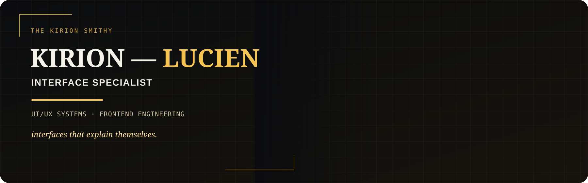

 

*interfaces that explain themselves.*

[**The Kirion Smithy**](https://github.com/The-Kirion-Smithy) · [**@Kirch-Nairu**](https://github.com/Kirch-Nairu)

---

## 01 — INTERFACE

**Lucien Marek Sol**

Interface Specialist of **[The Kirion Smithy](https://github.com/The-Kirion-Smithy)**.

I shape the layer where people meet systems — structure, interaction, visual hierarchy, responsive behavior, accessibility, and frontend implementation.

**Clarity is part of correctness.**

---

## 02 — DISCIPLINES

**01 · UI / UX SYSTEMS**  
`structure · flows · states`

**02 · FRONTEND ENGINEERING**  
`implementation · behavior · integration`

**03 · INFORMATION ARCHITECTURE**  
`organization · priority · navigation`

**04 · DESIGN SYSTEMS**  
`tokens · patterns · components`

**05 · INTERACTION DESIGN**  
`feedback · motion · transitions`

**06 · ACCESSIBILITY**  
`semantics · focus · inclusive use`

---

## 03 — FRAMES

`PUBLIC SERVICE` · `OPERATIONS` · `MOBILE` · `DESKTOP`

`DATA-DENSE` · `REALTIME` · `KIOSK / POS` · `OFFLINE / DEGRADED`

**One interface discipline. Different operating constraints.**

A citizen portal, accounting workstation, mobile workflow, kiosk, and realtime dashboard do not share the same density, input model, failure modes, or accessibility constraints. The interface should change with the system.

---

## 04 — CRAFT

**Hierarchy before decoration.**  
**State before animation.**  
**Accessibility before cleverness.**  
**Consistency before novelty.**  
**Evidence before preference.**

`HTML` · `CSS` · `JavaScript` · `TypeScript` · `React`

`components` · `tokens` · `state` · `responsive systems` · `testing`

---

## 05 — UNDER FORGE

### Frontend UI/UX Forge
`UNDER FORGE`

Practical interface training across responsive frames, application classes, component architecture, interaction states, accessibility, and frontend implementation.

### UI/UX Master
`UNDER FORGE`

Durable reference for interface architecture, information hierarchy, interaction patterns, design systems, accessibility, and frontend craft.

*The specialization is still being sharpened.*

---

**Clear intent. Quiet structure.**

[The Kirion Smithy](https://github.com/The-Kirion-Smithy) · [@Kirch-Nairu](https://github.com/Kirch-Nairu)

