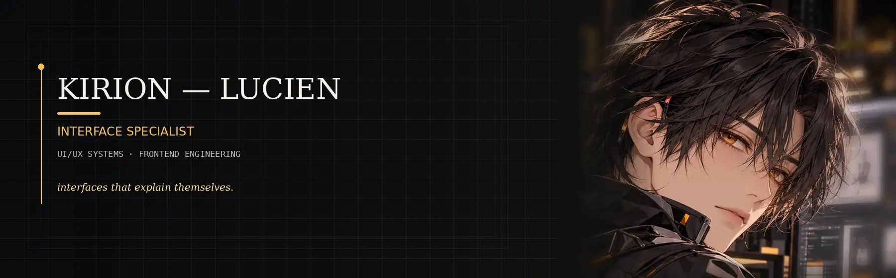

 

[**The Kirion Smithy**](https://github.com/The-Kirion-Smithy) · [**@Kirch-Nairu**](https://github.com/Kirch-Nairu)

---

## 01 — INTERFACE

**Lucien Marek Sol**

Interface Specialist of **[The Kirion Smithy](https://github.com/The-Kirion-Smithy)**.

I shape the layer where people meet systems — structure, interaction, visual hierarchy, responsive behavior, accessibility, and frontend implementation. The work is not finished when a screen looks polished. It is finished when the interface explains what matters, exposes the right actions, communicates state clearly, survives failure, and remains usable across the conditions it was designed for.

I care about the questions underneath the pixels: what deserves attention now, what can wait, what happens when an action fails, whether the same workflow still makes sense without a mouse, and whether the mobile experience was actually designed for mobile instead of compressed from desktop.

**Clarity is part of correctness.**

---

## 02 — DISCIPLINES

**01 · UI / UX SYSTEMS**  
`structure · flows · states`

**02 · FRONTEND ENGINEERING**  
`implementation · behavior · integration`

**03 · INFORMATION ARCHITECTURE**  
`organization · priority · navigation`

**04 · DESIGN SYSTEMS**  
`tokens · patterns · components`

**05 · INTERACTION DESIGN**  
`feedback · motion · transitions`

**06 · ACCESSIBILITY**  
`semantics · focus · inclusive use`

---

## 03 — FRAMES

`PUBLIC SERVICE` · `OPERATIONS` · `MOBILE` · `DESKTOP`

`DATA-DENSE` · `REALTIME` · `KIOSK / POS` · `OFFLINE / DEGRADED`

**One interface discipline. Different operating constraints.**

Different systems should not inherit the same interface merely because they share a frontend stack. A public-service portal has to earn trust and make unfamiliar tasks understandable. An operations surface may carry far more density, but still needs strong scanning, filtering, and prioritization. Mobile changes reach, interruption, input, and available space. Desktop can support more simultaneous context without becoming permission to fill every region.

Realtime products must make freshness, activity, and changing state legible. Kiosk and POS interfaces privilege speed, clarity, recoverability, and constrained input. Offline or degraded systems have to explain what remains available, what is pending, and what will happen when connectivity returns.

These are operating frames, not claims that every frame has already been delivered as a production project. The point is to design from constraints instead of forcing one visual recipe onto every system.

---

## 04 — CRAFT

**Hierarchy before decoration.**  
**State before animation.**  
**Accessibility before cleverness.**  
**Consistency before novelty.**  
**Evidence before preference.**

Implementation is part of the interface decision, not a handoff after it. Components should preserve meaning when reused. Responsive behavior should be intentional rather than accidental. Empty, loading, success, error, permission, retry, and disabled states deserve the same design attention as the ideal path. Keyboard focus and semantic structure are not cleanup tasks.

The implementation surface stays deliberately small:

`HTML` · `CSS` · `JavaScript` · `TypeScript` · `React`

`components` · `tokens` · `state` · `responsive systems` · `testing`

Tools matter when they help the interface remain understandable, predictable, and maintainable. They are not the identity.

---

## 05 — UNDER FORGE

### Frontend UI/UX Forge
`UNDER FORGE`

Practical interface training across responsive frames, application classes, component architecture, interaction states, accessibility, and frontend implementation. The goal is not to produce one signature visual style; it is to sharpen repeatable judgment across different human-facing system boundaries.

### UI/UX Master
`UNDER FORGE`

A durable reference for interface architecture, information hierarchy, interaction patterns, design systems, accessibility, and frontend craft. It is intended to become a long-lived working reference rather than a collection of trends or screenshots.

These specialization surfaces are still under development. They are not presented here as completed repositories or finished bodies of work.

*The specialization is still being sharpened.*

---

**Clear intent. Quiet structure.**

[The Kirion Smithy](https://github.com/The-Kirion-Smithy) · [@Kirch-Nairu](https://github.com/Kirch-Nairu)

